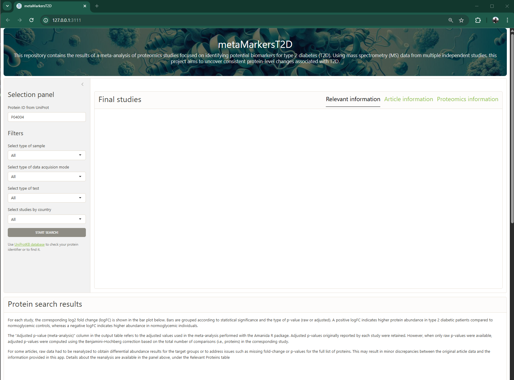
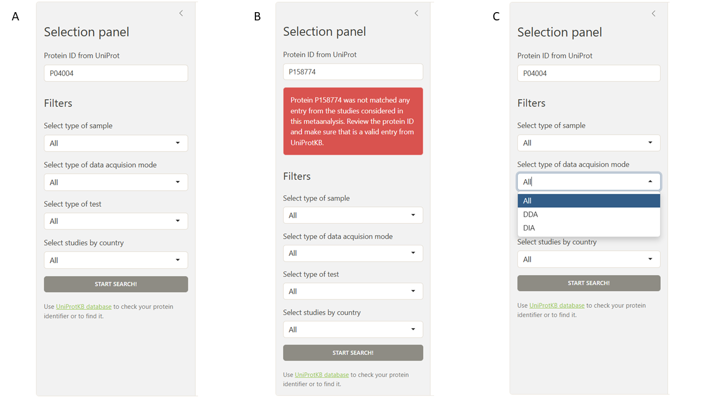
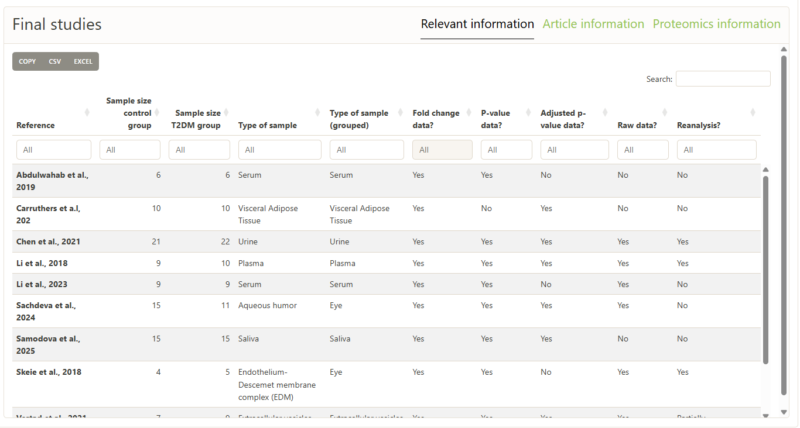
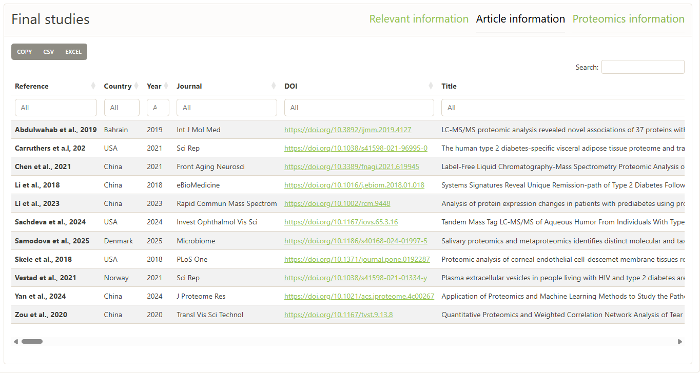
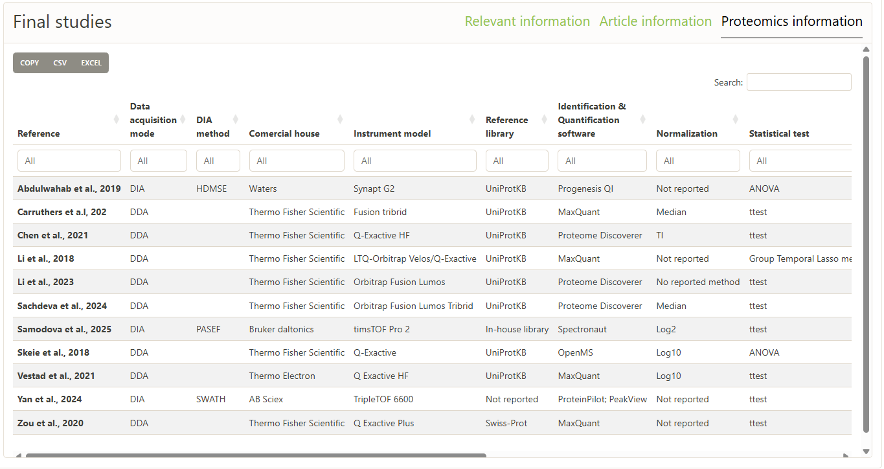
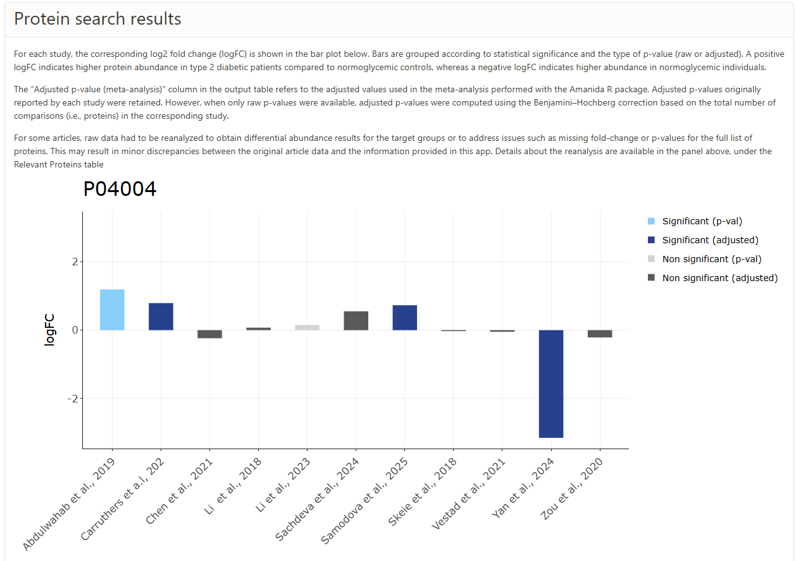
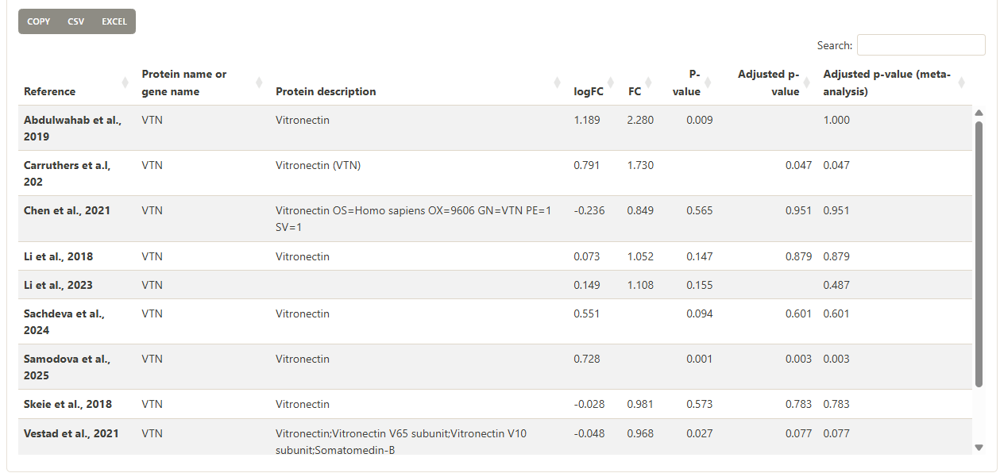

# metaMarkersT2D

This repository contains the shiny app code to access the results of a
meta-analysis of proteomics studies focused on identifying potential
biomarkers for type 2 diabetes (T2D).

- PROSPERO protocol:
  [CRD42025648346](https://www.crd.york.ac.uk/PROSPERO/view/CRD42025648346)

Clone the repository to run the app locally, or access it directly at
the following link: <https://jgcurras.shinyapps.io/metaMarkersT2D/>.

## App usage

### User interface

General overview:

### Selection panel

This user-friendly app features a left panel where the
[UniProt](https://www.uniprot.org/) protein ID of interest must be
entered. If the protein is not found in the database (i.e., it is not
present in any of the 27 final studies included in the meta-analysis), a
warning, red box will appear in this panel. If no warning is shown,
users can apply additional filters (such as sample type, data
acquisition mode, statistical test, or country) to refine the reported
studies. Then, by clicking the *START SEARCH!* button, the search
results will be displayed in the right and bottom panels.

### Top-right panel: results (I)

Once the *START SEARCH!* button is clicked, several outputs are
generated. The top-right panel displays three tables with basic
information about the articles in which the input protein was found,
including relevant details on study design, article metadata, and
proteomic data. These tables are located in separate overlapping tabs;
to view each one, simply click on the corresponding tab name.

#### Relevant information

#### Article description

#### Proteomic data

### Bottom panel: results (II)

The most important output of this app is displayed in this panel. First,
a bar plot shows all the studies in which the protein was found, with
bars representing the **magnitude and direction of the log₂ fold change
(logFC)**. The bars are color-coded based on the **significance of the
protein in each study**, taking into account whether p-values or
adjusted p-values were used as the significance metric.

The same information is also presented in a table, with articles listed
in rows and specific values for FC, logFC, p-values, adjusted p-values,
and the adjusted p-values used in the omics-based meta-analysis
(calculated when no adjusted value was originally provided).

This table can be copied or downloaded as an *Excel* or *CSV* file using
the panel in the top-left corner. Columns can be sorted, and information
can be searched using the bar in the top-right corner of the table.

### Contact information

Contact information is provided at the bottom of the webpage, along with
a link to the GitHub repository where issues can be reported.

